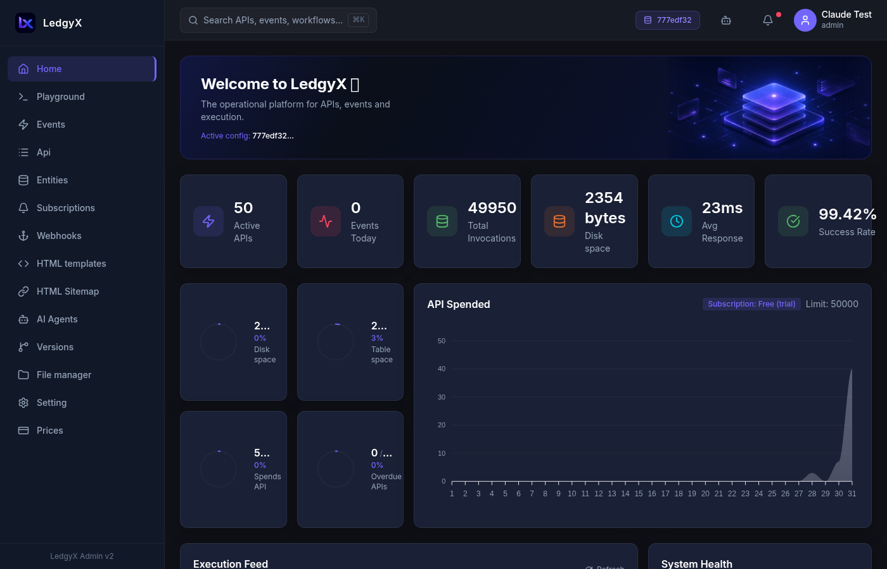
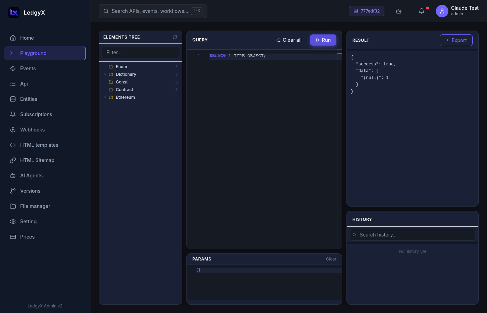
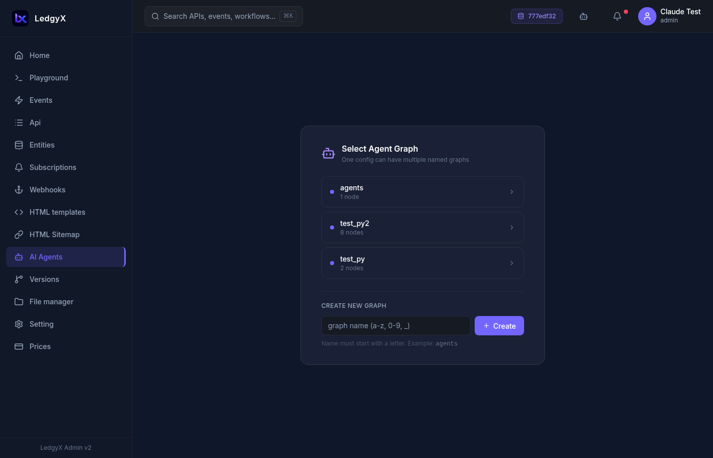
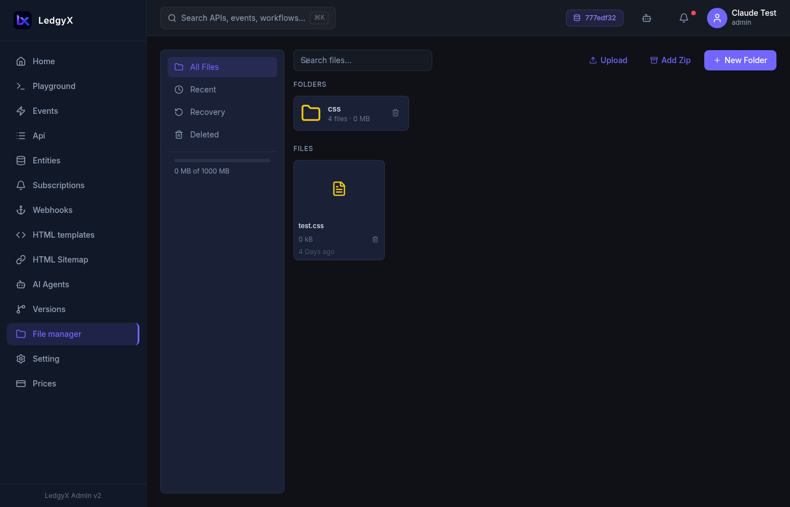

# Ledgyx Admin

  

**Ledgyx Admin** is the control panel for the Ledgyx operational platform — a tool for building APIs, managing data, automating workflows, creating websites, and deploying AI agents, all in one place.

---

## What you can build

- **REST APIs** — define SQL event handlers and expose them as HTTP endpoints with automatic documentation
- **Data models** — design entities with typed fields; the platform stores and queries them for you
- **Websites & landing pages** — author Mustache HTML templates wired to data events, served under your domain
- **AI agents** — visually connect agents, skills, and triggers on a graph canvas; run them on demand or via Telegram/webhook
- **Automations** — subscribe to data changes, blockchain events, and timers; chain events with CALL providers

---

## Screenshots

### Dashboard

  

### SQL Playground

  

### AI Agents Canvas

  

### AI Builder Chat

  

### API Builder

  

### File Manager

  

---

## Getting started

1. **Log in** — use your email/password or Google/GitHub OAuth
2. **Select a configuration** — go to [Settings](docs/pages/settings.md) and activate the workspace you want to work in
3. **Explore** — the sidebar gives you access to all sections

New to Ledgyx? Start with:
- [Platform Overview](docs/architecture.md) — understand core concepts
- [Playground](docs/pages/playground.md) — run your first query
- [Events](docs/pages/events.md) — create your first API handler
- [AI Builder](docs/ai-builder.md) — let the AI build a project for you

---

## Navigation

| Section | What it's for |
|---|---|
| **Home** | Dashboard with KPI cards and charts for your active configuration |
| **Playground** | Interactive SQL console with entity tree and query history |
| **Events** | Define SQL handlers for your API methods |
| **API** | Manage endpoint groups, test your REST API, view auto-generated docs |
| **Entities** | Design data model schemas (types, fields) |
| **Subscriptions** | React to data changes, blockchain events, and timers |
| **Webhooks** | Configure outbound HTTP integrations |
| **Templates** | Author Mustache HTML templates and JavaScript files |
| **Sitemap** | Map URL paths to templates and event handlers |
| **File Manager** | Upload and manage files on your tenant disk |
| **Settings** | Configurations, API keys, domains, AI credentials, Telegram bots, and more |
| **Versions** | Snapshot event changes and promote them to production |
| **AI Agents** | Build and deploy AI agents on a visual graph canvas |

---

## Documentation

### Platform
- [Platform Overview](docs/architecture.md)
- [Getting Started](docs/getting-started.md)
- [Configuration & Multi-tenancy](docs/configuration.md)
- [Ineron SQL Reference](docs/ineron-sql.md)

### Pages
- [Home / Dashboard](docs/pages/home.md)
- [Playground](docs/pages/playground.md)
- [Events](docs/pages/events.md)
- [API Builder](docs/pages/api-builder.md)
- [Entities](docs/pages/entities.md)
- [Templates](docs/pages/templates.md)
- [Sitemap](docs/pages/sitemap.md)
- [Subscriptions](docs/pages/subscriptions.md)
- [Webhooks](docs/pages/webhooks.md)
- [File Manager](docs/pages/file-manager.md)
- [Settings](docs/pages/settings.md)
- [Versions](docs/pages/versions.md)

### AI
- [AI Agents](docs/pages/ai-agents.md)
- [AI Builder](docs/ai-builder.md)
