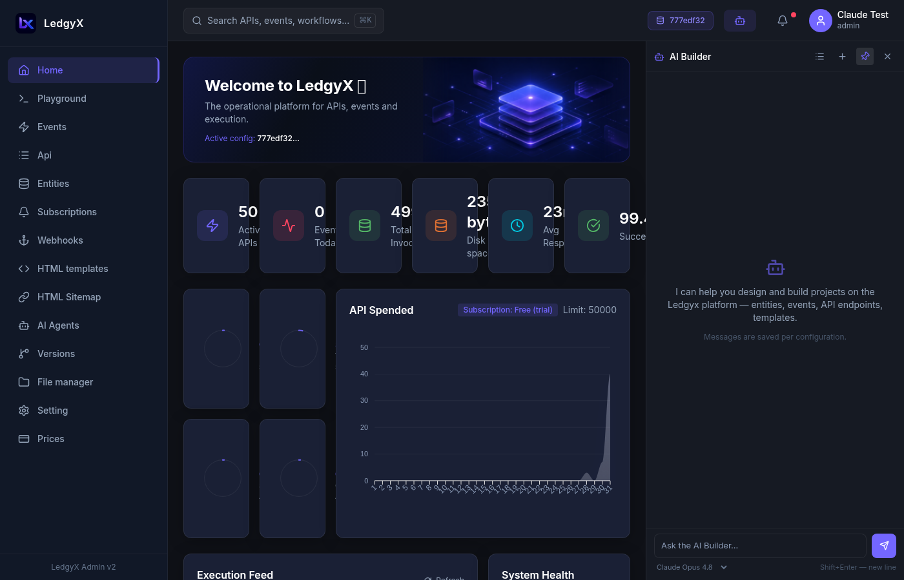
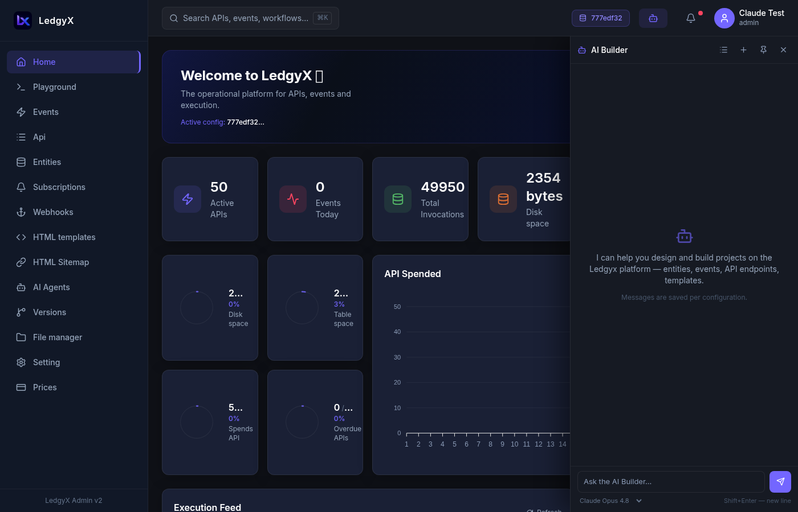

# AI Builder

The AI Builder is a chat assistant built into the admin panel that can **build entire platform projects through conversation** — creating entities, events, API endpoints, HTML templates, sitemap routes, and AI agents on your behalf.

<p align="center">
  
</p>

---

## Opening the chat

Click the **Bot icon** in the top-right of the header. The chat panel opens as an overlay on the right side (400px wide, below the header).

**Pin the panel** (pin icon) to work side-by-side — the main content area shifts left to make room.

---

## What the AI Builder can do

The assistant has access to **26 tools** it uses automatically to build your project:

### Reading your configuration
- List all entities, events, endpoints, templates, sitemap routes, webhooks, subscriptions, agents
- Get the details and SQL of any existing object
- Browse your tenant disk files

### Creating objects
- **Create entities** with typed fields
- **Create events** with SQL handlers for GET/POST/PUT/DELETE methods
- **Create API endpoints** grouped into REST resource paths
- **Create Mustache templates** (HTML and JavaScript)
- **Create sitemap routes** mapping URLs to templates and events
- **Write files to disk** (CSS, JavaScript, JSON, and other static assets)
- **Create AI agents** and deploy them

---

## How to use it

### Simple requests

For single-object operations, just ask directly:

> "Create an entity called 'HotelRoom' with fields: room_number (String), floor (Number), is_available (Boolean)"

> "Add a GET event handler for 'rooms/list' that returns all available rooms"

> "Create an API endpoint 'rooms/list' in the group 'rooms'"

The assistant executes each action immediately and confirms.

### Full project builds

For multi-object projects, the assistant follows a structured flow:

1. **You describe the project** — "Build a product catalog with categories, products, a REST API, and a public-facing HTML page"

2. **The assistant creates a plan** — it summarizes what it will create (entities, events, endpoints, templates, sitemap) and asks for your confirmation:

   ```
   📋 Plan: Product Catalog
   
   Entities: Category (name, description), Product (title, price, "comment", category_ref)
   Events: products/list (GET), products/create (POST), categories/list (GET)
   Endpoints: GET /products/list, POST /products/create, GET /categories/list
   Templates: layouts/main.html (layout+default), pages/catalog.html
   Disk files: css/catalog.css, js/catalog.js
   Sitemap: /catalog → pages/catalog.html + event products/list
   
   ⏸ Awaiting your confirmation
   ```

3. **You confirm** — "yes, go ahead" (or request changes)

4. **The assistant executes** — you see tool chips as it works:
   - 🔧 Create Entity → ✓
   - 🔧 Create Event → ✓
   - 🔧 Create Endpoint → ✓
   - 🔧 Write Disk File → ✓
   - 🔧 Create Template → ✓

<p align="center">
  
</p>

---

## Chat sessions

Each configuration has its own set of chat sessions. Previous conversations are saved and can be resumed.

**Session list** — click the List icon in the chat header to see all sessions for the current config. Click any session to resume it. Delete sessions with the trash icon.

**New chat** — click the Plus icon to start a fresh conversation.

---

## Model selector

At the bottom of the chat panel, choose which LLM powers the assistant:
- **Claude Opus 4.8** — most capable, best for complex multi-step builds
- **Claude Sonnet 4.6** — recommended default — fast and capable
- **Claude Haiku 4.5** — fastest and cheapest, good for simple tasks

The model is fixed for the lifetime of a session — choose before sending the first message.

---

## Context window indicator

A thin progress bar below the model selector shows how much of the model's context window is used. When it turns **amber** (≥75%) you're approaching the limit; consider starting a new chat. **Red** (≥90%) means you're very close — start a new chat soon.

> Long builds (10+ object projects) consume significant context. If the assistant starts behaving strangely or "forgetting" earlier steps, start a new session and continue from where you left off.

---

## Tips for better results

**Be specific about field types:**
> ✅ "Create a Product entity with fields: title (String), price (Number), description (String), is_featured (Boolean)"  
> ❌ "Create a Product entity"

**Name events clearly:**
> ✅ "Create event 'products/list' with a GET handler"  
> The event ID (`products/list`) becomes the reference used everywhere — choose it deliberately.

**Confirm before executing:**
For any multi-object project, wait for the preview plan. Review it and request changes if needed before confirming.

**Verify the result:**
After a build, open the relevant pages (Events, API Builder, Templates, Sitemap) to confirm everything was created as expected. The Test button in API Builder lets you hit the live endpoints immediately.

**Start fresh for each project:**
Use separate chat sessions for separate projects. Mixing multiple builds in one session increases context usage and can confuse the assistant.

---

## Example prompts

```
Build a hotel room booking system with:
- Entities: Hotel (name, city, stars), Room (number, type, price, hotel_ref)
- CRUD events for rooms
- REST API with /hotels and /rooms groups
- A public listing page at /rooms
```

```
Create a simple blog with posts. Include a title, content, author name, and published date.
I need GET (list all posts) and POST (create post) event handlers, API endpoints, 
a Mustache template for the listing page, and a sitemap route at /blog.
Add some basic CSS to the disk.
```

```
Build me a Telegram bot agent that:
- Receives messages from users
- Looks up their hotel booking in the Room entity
- Replies with their room number and check-in date
```
