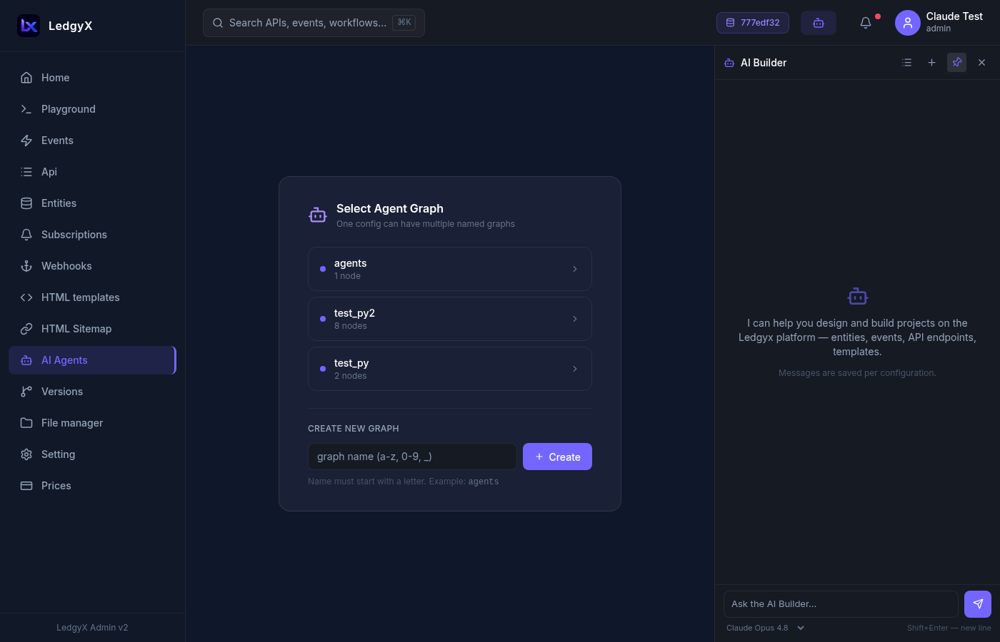

# AI Agents

The AI Agents page is a visual canvas for building, connecting, and deploying AI agents. You drag nodes onto a graph, connect them with edges to define relationships and data flow, then deploy and monitor your agents in real time.

<p align="center">
  
</p>

---

## Canvas overview

The canvas uses a node-and-edge graph where:
- **Nodes** represent components (agents, skills, triggers, events)
- **Edges** represent relationships between them (has skill, triggers, outputs to)

### Node types

| Node | Color | What it represents |
|---|---|---|
| **Agent** | Violet `#7366FF` | An LLM-powered AI agent with a system prompt and model |
| **SystemSkill** | Emerald `#10b981` | A platform-provided execution environment (run shell commands, Python, Telegram) |
| **UserSkill** | Amber `#f59e0b` | A custom skill you define (a script on your tenant disk) |
| **Trigger** | Red `#ef4444` | An entry point that starts the agent (Telegram message, webhook call, cron schedule, manual test) |
| **Event** | Blue `#3b82f6` | A platform event connected to the agent's output |
| **Knowledge** | Purple `#8b5cf6` | A knowledge base the agent can reference |
| **Pipeline** | Sky `#0ea5e9` | A reference to another agent graph used as a reusable component |

### Edge types

| Edge | Meaning |
|---|---|
| `HAS_SKILL` | Agent has access to this skill as a callable tool |
| `TRIGGERS_EVENT` | Trigger activates this agent |
| `NEXT` | Agent output flows to the next node |
| `ON_RESULT` | Connects to a handler for the agent's result |
| `USES_CREDENTIAL` | Agent uses this credential for LLM calls |

---

## Building your first agent

### Step 1: Add an Agent node

Click **Add node** in the toolbar, select `Agent`, and click the canvas. The Inspector panel opens on the right.

Fill in the **Properties** tab:
- **Name** — identifier for the agent (used in CALL statements, e.g. `support_bot`)
- **Model** — LLM model to use (`claude-sonnet-4-6`, `claude-haiku-4-5`, `gpt-4o`, etc.)
- **System Prompt** — instructions for the agent
- **Temperature** — creativity (0 = deterministic, 1 = creative)
- **Max Iterations** — how many LLM ↔ tool cycles the agent can run (default 8)
- **Autopilot** — if enabled, agent acts autonomously without human confirmation

Click **Save**.

<p align="center">
  
</p>

### Step 2: Add skills

Skills are the tools your agent can call. Add a **SystemSkill** node:
- `execute_shell` — runs shell commands in an isolated virtual machine
- `execute_python` — runs Python code in a VM
- `telegram_reply` — sends a reply to the user via Telegram
- `call_pipeline` — calls another agent graph as a sub-task

Connect skills to your agent by dragging from the agent's output handle to the skill node. When the edge dialog appears, select **HAS_SKILL**.

### Step 3: Add a Trigger

Add a **Trigger** node and select the trigger type:

| Type | When it fires |
|---|---|
| `telegram` | A Telegram message arrives at your bot |
| `webhook` | An HTTP POST arrives at a webhook URL |
| `cron` | A scheduled time (cron expression) |
| `text_input` | Manual test from the Inspector panel |

Connect the Trigger to your Agent with a **TRIGGERS_EVENT** edge.

### Step 4: Deploy the agent

Select your Agent node and click **Deploy Agent** in the Properties tab. The platform:
1. Registers the agent with its connected skills
2. Sets status to `ready`
3. The agent is now ready to receive runs

Status badges: `draft` → `initializing` → `ready` → `stopped`

### Step 5: Activate the trigger

For Telegram, webhook, and cron triggers — select the Trigger node and click **Activate Trigger** in the Inspector. The platform automatically creates an event with the CALL SQL and connects it to your agent.

After activation you'll see a green ✅ badge with the event ID.

For Telegram specifically: after activating, click **Register Webhook URL** to tell Telegram where to send messages.

---

## Testing an agent

Use a **text_input** Trigger for manual testing:
1. Add a Trigger node with type `text_input`
2. Connect it to your Agent
3. Select the Trigger node in the Inspector
4. Type your test input in the **Test Run** textarea
5. Click **Send** — the agent runs immediately

---

## Monitoring runs

Select an Agent node and click the **Runs** tab in the Inspector to see execution history:

<p align="center">
  
</p>

Each run shows:
- Status dot (green = done, amber = running, red = failed)
- The task/input text
- Number of steps
- Timestamp

Click a run to see **step details**:
- Each LLM call, tool use, and tool result
- Input and output for each step (truncated preview, expandable)
- Token usage and duration in ms

---

## User Skills

**UserSkill** nodes let you define custom tools backed by scripts on your tenant disk.

1. Add a **UserSkill** node and open Properties
2. Fill in:
   - **Name** — how the LLM sees this tool
   - **Description** — what the tool does (used by LLM for tool selection)
   - **Executor** — `execute_python` or `execute_shell`
   - **Input Schema** — JSON Schema defining the tool's input parameters
   - **Source File** — path to the script on your disk (e.g. `knowledge/my_tool.py`)
3. Click **Register** — the skill is saved to the platform

**SKILL.md format** (alternative to manual entry): upload a `.md` file with YAML frontmatter:
```
---
name: data_processor
executor: execute_python
source_file: knowledge/processor.py
input_schema: {"type":"object","properties":{"data":{"type":"string"}}}
---
This skill processes incoming data...
```

Click **Load SKILL.md** in the SkillSection to parse it automatically.

---

## Agent Templates

Don't start from scratch — use the **Template Gallery** (book icon in the toolbar) to load a pre-built agent:

<p align="center">
  
</p>

**Built-in templates include:**
- Customer Support Bot
- Python Data Analyst
- Content Writer
- Hotel Concierge (UAE)
- Telegram Alert Bot
- Pipeline Orchestrator
- And more…

**My Templates tab:** Save any of your deployed agents as a template — great for reusing proven patterns across configurations.

To save as template: select your Agent node → Properties → fill in the "Save as Template" form at the bottom → Save Template.

---

## Pipeline composition

You can compose multiple agent graphs into pipelines. Mark a graph as a "library component" by adding a **Trigger** node with type `subgraph_input`. Other graphs can then reference it via a **Pipeline** node — the agent in the calling graph can invoke the library sub-agent as a tool.

---

## Tips

- Connect nodes by dragging from the small handle (dot) on one node to another — the edge type selector appears.
- Click any edge to delete it (with inline confirmation).
- Deleting a node removes it from the graph but does **not** un-deploy a running agent — use the Deploy section to update.
- Agent names are identifiers used in `CALL(AGENT "name" ...)` SQL — keep them unique and meaningful.
- After changing a system prompt or connecting new skills, click **Deploy Agent** again to update the running configuration.
