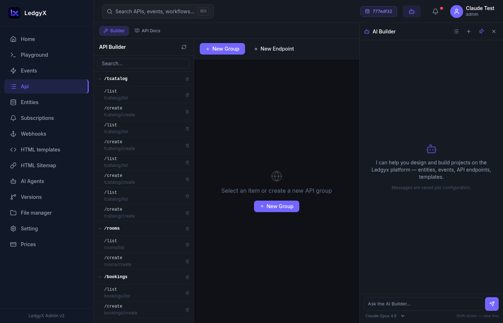
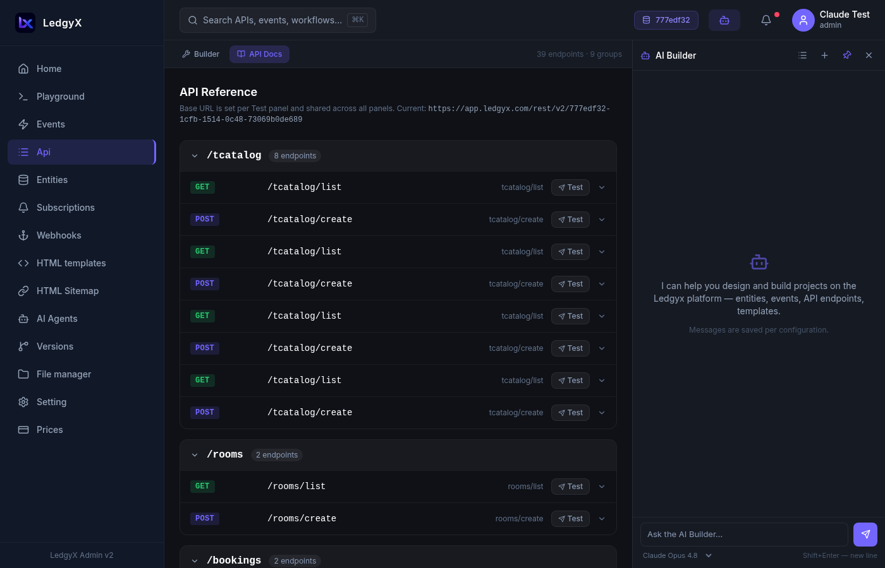

# API Builder

The API Builder lets you organize your events into a structured REST API — grouped by resource, documented automatically, and testable right from the admin panel.

<p align="center">
  
</p>

## Two modes

Use the toggle at the top to switch between **Builder** and **API Docs** mode.

### Builder mode

The builder is a tree editor for your API structure:

**Left panel** — the API tree. Groups are folders, endpoints are leaves. Click to select; the form opens on the right.

**Right panel** — the form for the selected item:
- **Group**: name (used in the URL path) and description
- **Endpoint**: name, parent group, linked event, and description

The URL preview updates in real time as you type — e.g. `/products/list`.

**Toolbar actions:**
- **New Group** — create a URL group (folder)
- **New Endpoint** — create an endpoint inside a group
- **Save** — save the current item
- **Test** — open the TestPanel for the selected endpoint (only shown for existing endpoints)
- **Delete** — remove with inline confirmation

### API Docs mode

A Swagger/FastAPI-style documentation view of your entire API:

<p align="center">
  
</p>

- Groups appear as collapsible cards
- Each endpoint shows colored method badges (GET / POST / PUT / DELETE) based on which SQL handlers are defined
- Expanding an endpoint reveals the full URL, curl examples from the description, and the linked event name
- The **Test** button opens the TestPanel inline

## Testing endpoints

The **TestPanel** is available in both modes and lets you send real requests to your API:

1. **Base URL** — defaults to `https://app.ledgyx.com/rest/v2/{api-key}`. You can change it to test against a different environment (saved per browser).
2. **Method tabs** — only methods with SQL handlers are shown; switch between GET/POST/PUT/DELETE
3. **Full URL bar** — editable path + copy button
4. **Headers** — add key/value pairs (for auth tokens, API keys, custom headers)
5. **Query Params** (GET) or **JSON Body** with a Format button (POST/PUT/DELETE)
6. **Send** — executes the request; shows status badge (green for 2xx, amber for 4xx, red for 5xx), response time in ms, and the response body

<p align="center">
  
</p>

> **Note:** Test requests are proxied through the Ledgyx backend to avoid browser CORS restrictions — you're hitting the real API, not a mock.

## URL structure

Your API endpoints are available at:
```
https://app.ledgyx.com/rest/v2/{api-key}/{group}/{endpoint}
```

Find your `{api-key}` in **Settings → API Keys**.

## Tips

- Group names and endpoint names become URL path segments — use lowercase, no spaces (spaces are converted to dashes automatically).
- The description field in an endpoint can contain curl examples — they appear verbatim in API Docs mode.
- Base URL is synced between Builder and Docs — change it once, it applies everywhere.
- An endpoint with no SQL handlers for a method shows `ANY` as the method badge — go to Events to add the handler.
