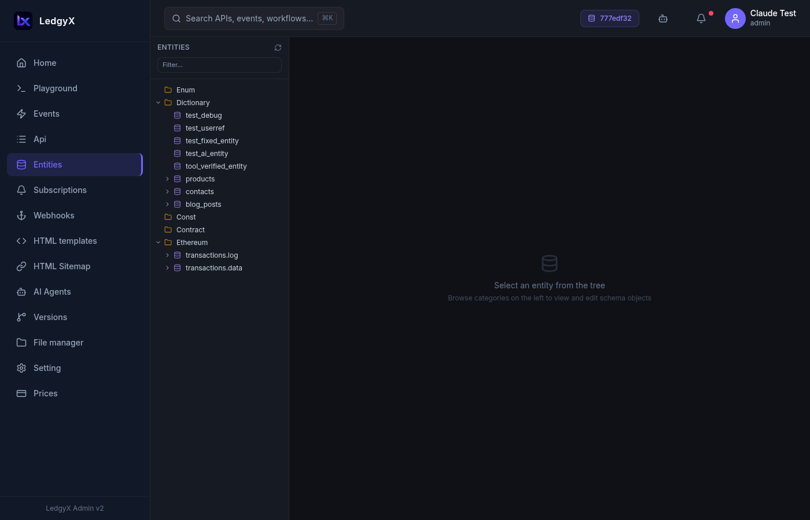

# Entities

Entities define the **data model** of your configuration — what objects your platform stores and what fields they have. Think of them like typed tables, but with a schema you control through the UI.

<p align="center">
  
</p>

## Entity types

Every entity has a **type** that determines how the platform treats it:

| Type | Description |
|---|---|
| **Dictionary** | General-purpose records with custom fields — the most common type |
| **Enum** | A fixed set of named values |
| **Const** | Constant values defined once |
| And more… | The platform supports additional system types for specialized use cases |

## Browsing entities

The left panel shows a tree of all entities in your active configuration, organized by type category. Click a category (e.g. "Dictionary") to see all objects of that type. Click a specific entity to open its editor.

## Creating an entity

1. Select a category in the entity tree (e.g. "Dictionary")
2. Click **New Entity** in the right panel
3. Enter a **name** — use only letters, numbers, and underscores (e.g. `Product`, `hotel_room`)
4. Select the **type** from the dropdown
5. Add fields using the field builder at the bottom:
   - Enter a field **name**
   - Select a **type** (see field types below)
   - Optionally add a **description**
   - Click **Append** to add it to the pending list
6. Click **Create Entity** — all fields are created at once

<p align="center">
  
</p>

## Field types

### Scalar types (simple values)
| Type | Use for |
|---|---|
| **String** | Text values |
| **Number** | Integer and decimal numbers |
| **Boolean** | True/false |
| **Date** | Date and time |
| **JSON** | Arbitrary JSON data |
| **Address** | Blockchain or wallet address |
| **Data** | Binary data |

### Object references
Any entity you create can be used as a **field type** in other entities — this creates a relationship between them. Object reference fields appear with a violet badge in the field list.

## Editing an entity

Click an entity in the tree to open its editor:

- **Fields list** — all current fields with type badges (green = scalar, violet = object reference)
- **Add Field** — click to reveal an inline form; fill in name, type, description; click Save Field
- **Edit a field** — click the field row to pre-fill the form; click Update to save
- **Delete a field** — click the trash icon on the field row; takes effect immediately
- **Delete Entity** — button at the bottom with inline confirmation

> **Note:** Entity names cannot be changed after creation — the name is part of the entity's permanent identity. To rename, create a new entity with the desired name.

## Using entities in SQL

Once created, entity types are available immediately in Ineron SQL:

```sql
-- Query all Product records
SELECT p.ref() AS id, p.title, p.price
FROM Dictionary.Product AS p
TYPE LIST;

-- Query with a related entity
SELECT
  r.ref() AS id,
  r.room_number,
  r.hotel.name AS hotel_name
FROM Dictionary.HotelRoom AS r
TYPE LIST;
```

Entities also appear in the **Playground entity tree** automatically.

## Tips

- Create entities before creating events — you need the entity name to write the event SQL.
- Field names follow the same rules as column names — lowercase recommended, no spaces.
- If you need to reference one entity from another (a relationship), add a field of the related entity's type.
