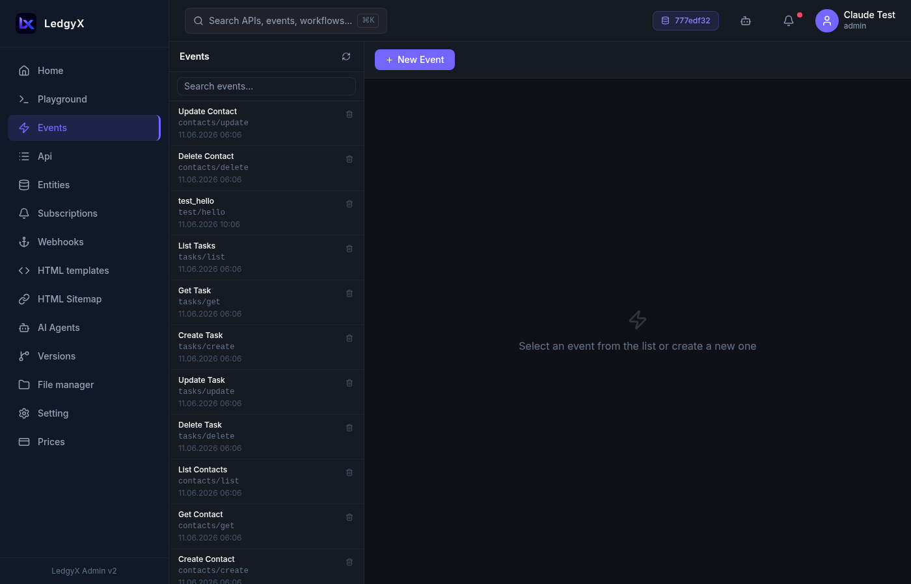
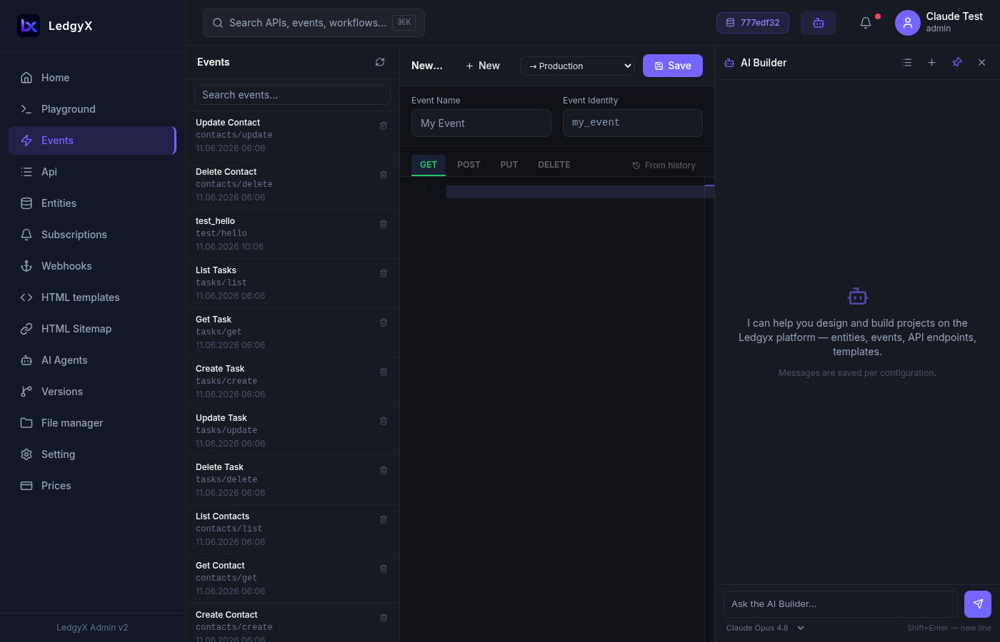

# Events

Events are the heart of the Ledgyx platform. An **event** is a named SQL handler that the platform executes when an HTTP request arrives at a matching API endpoint, or when triggered by a subscription, webhook, Telegram message, or AI agent.

<p align="center">
  
</p>

## What is an event?

Each event has a string identifier (e.g. `products/list`, `orders/create`) and up to **four method handlers**:

| Method | Typical use |
|---|---|
| **GET** | Read data, return a list or object |
| **POST** | Create a record, process incoming data |
| **PUT** | Update an existing record |
| **DELETE** | Remove a record |

You don't have to define all four — only the methods you need.

## Creating an event

1. Click **New** in the toolbar
2. Enter an **Event ID** — this is the slug used to reference the event everywhere (e.g. `products/list`). Use lowercase letters, numbers, and slashes.
3. Select the method tab (GET / POST / PUT / DELETE) you want to add a handler for
4. Write your Ineron SQL query in the Monaco editor
5. Click **Save**

<p align="center">
  
</p>

## Writing event SQL

Use Ineron SQL syntax (see [Ineron SQL Reference](../ineron-sql.md)). Parameters from the HTTP request are available as:

- `&body.field` — a field from the POST/PUT request body
- `&params.field` — a URL query parameter or path segment
- `&body` — the entire request body as JSON

Example GET handler (returns a list of products):
```sql
SELECT
  p.ref() AS id,
  p.title,
  p.price,
  p.description
FROM Dictionary.Product AS p
TYPE LIST;
```

Example POST handler (creates a product):
```sql
INSERT INTO Dictionary.Product (title, price, description)
VALUES (&body.title, &body.price::NUMBER, &body.description)
TYPE OBJECT;
```

## CALL providers

Event handlers can do more than just query data. Use `CALL` to invoke platform services:

- **Run an AI agent:** `CALL(AGENT "agent_name" FROM &body NEXT "reply_event" POST)`
- **Send a Telegram message:** `CALL(TG_SEND_MESSAGE "bot_name" FROM &body)`
- **Call an external webhook:** `CALL(WEBHOOK "webhook_name" FROM &body)`
- **Push a real-time SSE update:** `CALL(SSE_SEND "token_name" FROM &body)`
- **Call an LLM directly:** `CALL(AI_CHAT_COMPLETION "creds" AI_SCHEMAS "schema" FROM &body)`

See [Ineron SQL Reference — CALL providers](../ineron-sql.md#call-providers) for full syntax.

## From history picker

Working in Playground and found the perfect query? Bring it directly into an event:

1. Open an event and select a method tab
2. Click the **history icon** (clock) to the right of the method tabs
3. Pick a query from your Playground history
4. It loads into the editor — adjust and save

The picker stays open after selection so you can try multiple queries before committing.

## Versioning events

Events participate in the [Versions](versions.md) system. Before saving a change to production, you can save it to a **snapshot** first using the snapshot selector next to the Save button. This lets you review and compare changes before promoting them.

## Deleting an event

Click **Delete** in the toolbar and confirm inline. Note that deleting an event that is referenced by API endpoints or subscriptions will break those connections — check references first.

## Tips

- Event IDs are permanent and used for referencing — choose meaningful names upfront (e.g. `products/list`, not `ev1`).
- The same event can be triggered by multiple sources: an API endpoint, a subscription, a Telegram webhook, and an AI agent CALL — all at once.
- Use the Playground to develop and test queries, then paste them into event handlers.
