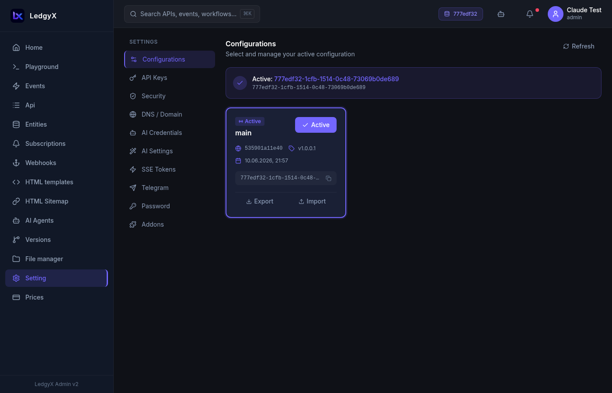
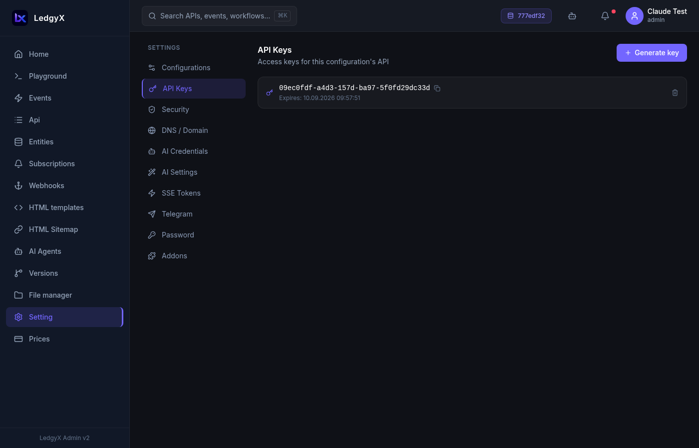
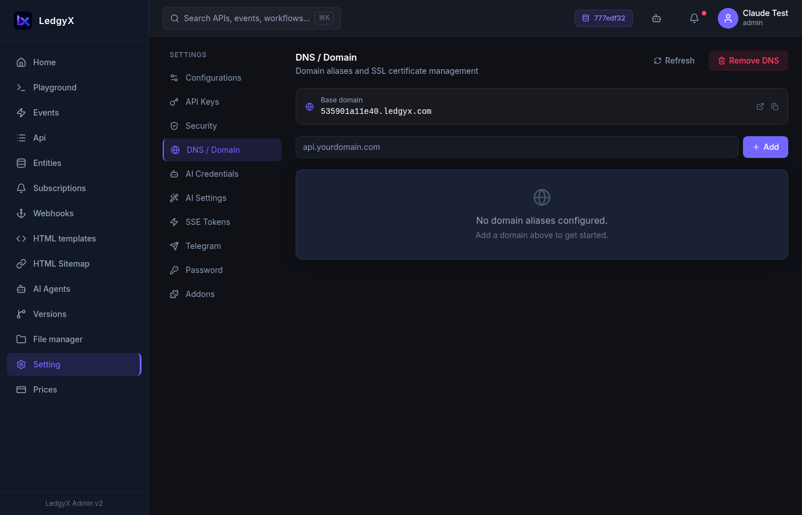
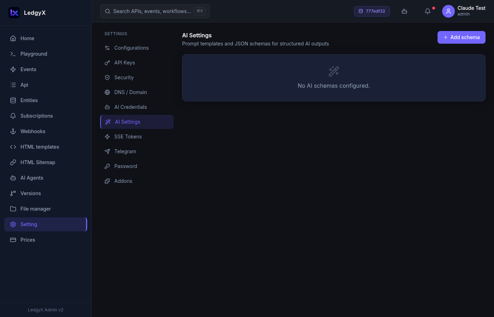
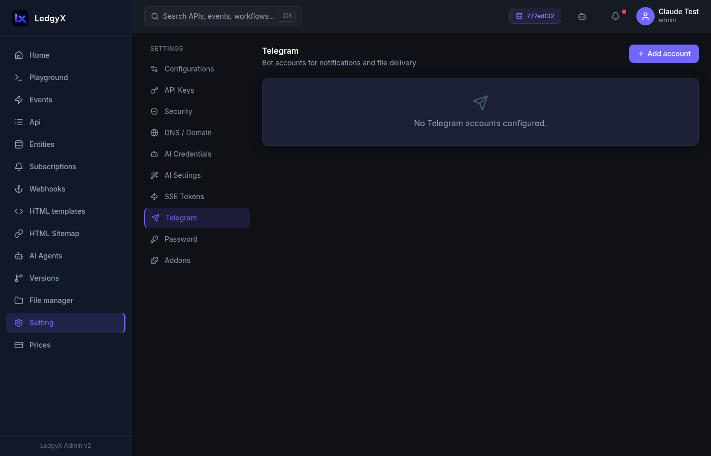

# Settings

Settings is your configuration control center. It has nine tabs, each managing a different aspect of your workspace or account.

<p align="center">
  
</p>

## Navigating Settings

The left side of Settings has an icon navigation bar. Click an icon to switch tabs. Your last-visited tab is remembered between page reloads.

---

## Configurations

Manage your tenant workspaces. Each configuration card shows the name, ID, and status.

- **Activate** — makes this configuration the active workspace for all data pages. The active config has a violet border and an "Active" badge.
- **Create new** — add a new configuration
- Switching config reloads all data pages with the new workspace

---

## API Keys

API keys are UUID tokens that external callers use to access your REST API.

<p align="center">
  
</p>

- **Add key** — enter a name and optional expiry date; the token is generated automatically
- **Copy** — copies the token to clipboard
- **Revoke** — permanently invalidates the key (inline confirmation)

Your REST API URL: `https://app.ledgyx.com/rest/v2/{api-key}/{group}/{endpoint}`

---

## Security

Access control groups for your configuration — lets you define permission rules for different user roles.

---

## DNS / Domain

Manage the domain for your configuration's public-facing website.

**Base domain:** Every configuration has an automatically assigned domain:
```
{config-id}.ledgyx.com
```

**Custom domains (aliases):**
1. Enter your custom domain and click Add
2. The platform shows a **TXT record** to add to your DNS provider
3. Click **Request verification** once the TXT record is live
4. Status updates to Verified → SSL certificate is issued automatically

Additional controls:
- **Refresh DNS** — regenerate the base domain UUID
- **Remove DNS** — remove the base domain

<p align="center">
  
</p>

---

## AI Credentials

Store API keys for LLM providers used in your events and AI agents.

Supported providers: OpenAI, Anthropic, Mistral, and others.

**Fields:**
- **Name** — identifier used in CALL statements (e.g. `openai`, `anthropic_creds`)
- **Provider** — select from the list
- **Model** — default model for this credential
- **API Key** — your provider's API key (stored securely)
- **Base URL**, **Max tokens**, **Temperature** — optional advanced settings

Each save creates a new version — previous versions are archived automatically.

---

## AI Settings

Prompt templates and JSON output schemas used with `AI_CHAT_COMPLETION` CALL providers.

**Fields:**
- **Schema name** — identifier used in `AI_SCHEMAS "name"` in CALL statements
- **Model** — default model override
- **Prompt template** — the system/user prompt with `{{variable}}` placeholders
- **JSON Schema** — defines the structure of the LLM's response (validated live in the editor)
- **Temperature**, **Response format**

<p align="center">
  
</p>

---

## SSE Tokens

Server-Sent Events tokens for pushing real-time updates to the browser.

- **Add token** — enter a name; the token value is auto-generated
- Use the token name in `CALL(SSE_SEND "token_name" FROM &body)` in your events
- **Delete** — removes the token with inline confirmation

---

## Telegram

Configure Telegram bot accounts for notifications and file delivery.

**Fields:**
- **Name** — display name for this bot account
- **Bot Token** — from BotFather (stored as a password field)
- **Channel ID** — default channel or chat to send to
- **Webhook URL** — URL where Telegram sends incoming messages
- **Files Folder** — default folder for file uploads from Telegram
- **Active** toggle — enable/disable this bot

Use the bot name in `CALL(TG_SEND_MESSAGE "bot_name" FROM &body)` in your events.

<p align="center">
  
</p>

---

## Password

Change your account password.

1. Enter your **Current Password**
2. Enter a **New Password** (show/hide toggle available)
3. **Confirm New Password** — shows "Passwords do not match" inline if they differ
4. Click **Save** — the form resets on success

---

## Addons

Stripe subscription plan management — upgrade your Ledgyx plan or manage billing.
