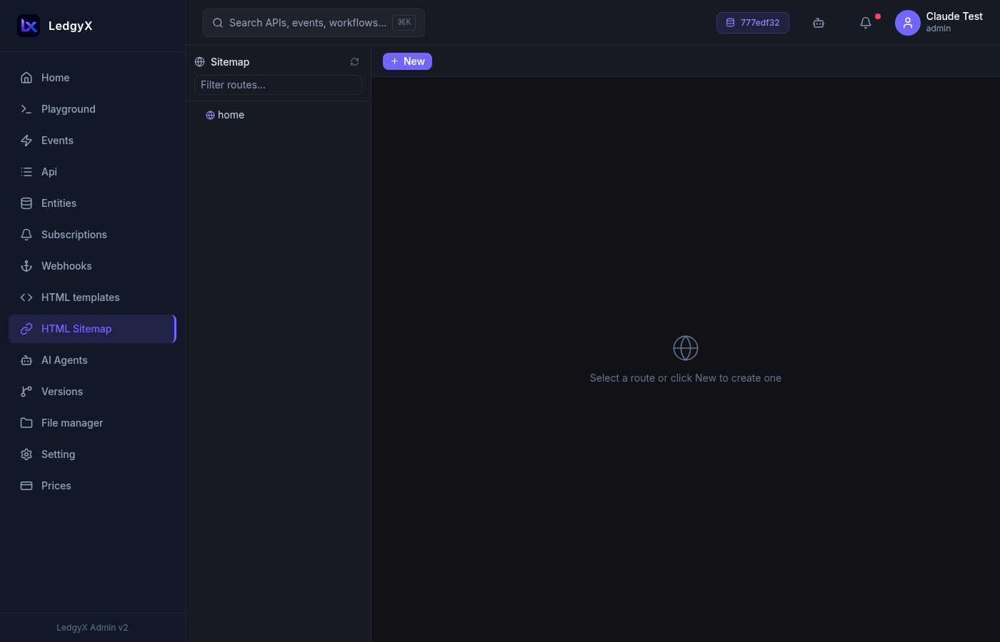

# Sitemap

The Sitemap maps URL paths to templates and event handlers — it's what makes your Ledgyx configuration a real website or web application with navigable pages.

<p align="center">
  
</p>

## What is a sitemap route?

Each route is a URL path segment that the platform matches when a request comes in. Routes can be nested to create hierarchical URLs:

```
/                     ← root
  products            ← /products
    list              ← /products/list
    detail            ← /products/detail
  about               ← /about
```

When the platform receives a request to `/products/list`, it:
1. Finds the matching sitemap route
2. Loads the assigned **layout** template
3. Calls the assigned **event** to get page data
4. Renders the Mustache template with that data

## Route fields

| Field | Description |
|---|---|
| **Parent** | The parent route (select from the full route tree) |
| **Name** | The URL segment name (e.g. `products`, `list`) — case-sensitive, mono font |
| **Regex** | Pattern for dynamic segments (default: `((/.*)?)` matches everything) |
| **Layout** | Which layout template wraps this page |
| **Event** | Which event provides the page data (GET method is called) |
| **Description** | Optional notes |

## Creating a route

1. Click **New** in the toolbar
2. Set the **Parent** (or leave blank for a root-level route)
3. Enter the **Name** — this becomes the URL segment
4. Set the **Regex** if you need dynamic matching (for most pages, the default is fine)
5. Select a **Layout** from the dropdown (only templates marked as layouts appear)
6. Select an **Event** that will provide the data for this page
7. Click **Save**

## Layout assignment

Each route can have its own layout template. This allows different sections of your site to have different shells:

```
/                     → layout: main.html  (homepage)
  products            → layout: shop.html  (shop layout with cart sidebar)
  login               → layout: minimal.html  (clean auth layout)
```

If a route has no layout assigned, the platform uses the **default layout** (the one marked as Default in Templates).

## Dynamic routes

Use the **Regex** field for routes that match patterns:

- `((/.*)?)` — matches the route and any path below it (default)
- `/([a-z0-9\-]+)` — matches a single lowercase slug segment (e.g. `/products/my-product`)

## Toolbar

- **New** — create a new route
- **Save** — save the current route
- **Delete** — soft-delete the route (inline confirmation). Deleted routes return 404.
- **Refresh** — reload the tree from the server

## Tips

- Route names are part of the URL and cannot be changed later without creating a new route — the old URL will stop working.
- If you need a route to match the root `/`, name it `/` (a single forward slash).
- The sitemap tree is rendered recursively — deeply nested routes (5+ levels) can become slow to navigate.
- Use the [AI Builder](../ai-builder.md) to set up sitemap routes as part of a full project build.
