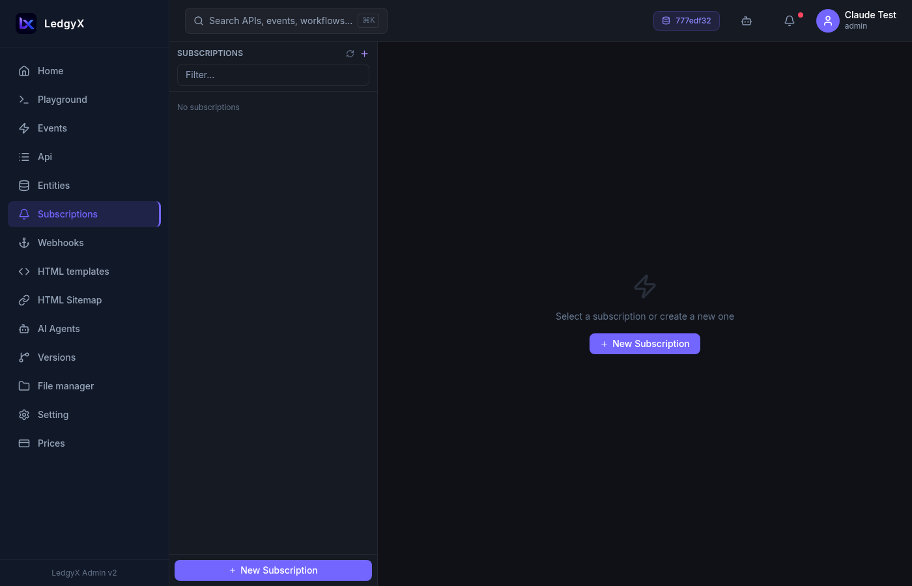

# Subscriptions

Subscriptions let you react to **data changes and system events** rather than HTTP requests. While events handle incoming API calls, subscriptions listen for things that happen inside your configuration — a record being created or updated, a blockchain event firing, a timer expiring.

  

## What triggers a subscription?

A subscription is bound to an **emitter** — an entity or system object that produces events:

| Emitter type | Triggers when |
|---|---|
| **Dictionary / Enum / Const** | A record of that entity type is created, updated, or deleted |
| **Contract** (blockchain) | A smart contract emits a specific ABI event |
| **Extdata** | External data source sends a notification |

When the emitter fires, the subscription runs the linked **event** (your SQL handler) to process the data.

## Subscriptions vs. Events (important distinction)

| | Events | Subscriptions |
|---|---|---|
| Triggered by | HTTP requests | Data changes, timers, blockchain |
| Example | `GET /products/list` | "When a new order is created, send a Telegram notification" |
| Telegram webhooks | ✅ Direct to Event (no subscription needed) | — |

> **Telegram and webhooks do NOT need subscriptions** — HTTP POST from Telegram goes directly to an Event handler. Subscriptions are only for data-change reactions.

## Creating a subscription

1. Click **New** in the list panel
2. Fill in the form:
   - **Name** — a label for this subscription
   - **Event Emitter** — select the entity or system object to watch
   - **Exec Event** — the event (SQL handler) to run when triggered
   - **Method** — GET / POST / PUT / DELETE (the HTTP method used to call the exec event)
3. Additional fields appear based on emitter type:
   - **Contract emitter**: select the **Contract Event** from the ABI
   - **Non-contract, non-Extdata emitter**: choose **Timing** — Pre (before the change) or Post (after the change)
4. Click **Save**

## Starting and stopping subscriptions

Each subscription in the list has a **Play ▶ / Stop ■** button:

- **▶ Play** — activates the subscription; the platform begins listening for the emitter
- **■ Stop** — pauses the subscription without deleting it

The current status is shown with a badge on the list row.

## Common use cases

**Notify on new record:**
Subscription on `Dictionary.Order` (Post) → exec event `orders/notify` → event SQL calls `CALL(TG_SEND_MESSAGE "my_bot" FROM &body)` to send a Telegram alert.

**Sync blockchain events:**
Subscription on `Contract.MyToken` with event `Transfer` → exec event `tokens/on_transfer` → event SQL records the transfer in your entity.

**Cascade on data change:**
Subscription on `Dictionary.Inventory` (Post) → exec event `inventory/check_low_stock` → event SQL checks quantity and fires a webhook if below threshold.

## Tips

- A single emitter can have **multiple subscriptions** — each running a different exec event.
- If you need to trigger an agent when data changes, use a subscription with an exec event that contains `CALL(AGENT "agent_name" FROM &body)`.
- Subscriptions are per-configuration — the same entity type in two different configurations has independent subscriptions.
