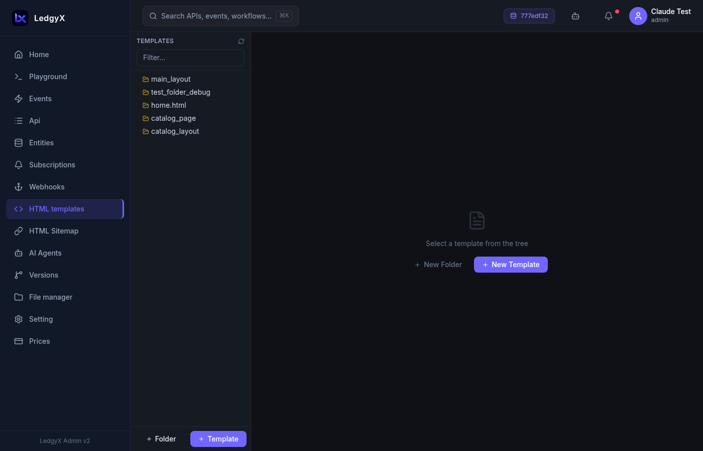

# Templates

Templates let you build HTML pages served directly by the platform — landing pages, dashboards, e-commerce storefronts, or any multi-page website. The platform uses **Mustache** — a simple, logic-less templating engine.

<p align="center">
  
</p>

## Template types

| Type | Description |
|---|---|
| **Group** | A folder for organizing templates — not rendered itself |
| **HTML Template** | A Mustache `.html` file that renders into a webpage |
| **Script** | A JavaScript file associated with the template system |

## Layout templates

One special kind of HTML template is a **layout** — the outer HTML shell (`<html>`, `<head>`, navigation, footer) that wraps your page content. Mark a template as a layout by checking the **Layout** checkbox.

If you mark a layout as **Default**, it will be used as the fallback for any page that doesn't have a specific layout assigned in the [Sitemap](sitemap.md).

> You should have only **one default layout** per configuration.

## Mustache syntax

Mustache is easy to learn — it uses `{{double curly braces}}` for everything:

```html
<!-- Output a variable (HTML-escaped) -->
<h1>{{title}}</h1>

<!-- Output HTML without escaping (use for trusted content only) -->
<div>{{{html_content}}}</div>

<!-- Conditional block (renders if value is truthy / non-empty) -->
{{#is_published}}
  <span class="badge">Published</span>
{{/is_published}}

<!-- Inverted block (renders if value is falsy / empty) -->
{{^items}}
  <p>No items found.</p>
{{/items}}

<!-- Loop over an array -->
{{#products}}
  <div class="card">
    <h2>{{title}}</h2>
    <p>{{price}}</p>
  </div>
{{/products}}

<!-- Include another template (partial) -->
{{> partials/header}}
```

## A typical project structure

```
layouts/
  main.html         ← Layout (is_layout ✓, is_default ✓)
pages/
  home.html         ← Page partial  {{> pages/home}} in layout
  products.html     ← Another page partial
```

The layout wraps the page:
```html
<!DOCTYPE html>
<html lang="en">
<head>
  <meta charset="UTF-8">
  <title>{{page_title}}</title>
  <link rel="stylesheet" href="/cdn/css/style.css">
</head>
<body>
  {{> navigation}}
  <main>
    {{> {{{page_partial}}} }}
  </main>
  <script src="/cdn/js/app.js"></script>
</body>
</html>
```

## Static files (CSS, JavaScript)

CSS and JavaScript files are not stored as templates — they live on your **tenant disk** and are accessible via `/cdn/`. Use the [File Manager](file-manager.md) to upload them, or let the [AI Builder](../ai-builder.md) generate and upload them for you.

Reference them in your layout:
```html
<link rel="stylesheet" href="/cdn/css/style.css">
<script src="/cdn/js/app.js"></script>
```

## Creating a template

1. Click **New Folder** to create a group, or **New Template** to create a file
2. Enter the **name** — for files, include the extension (e.g. `home.html`)
3. Select the **type** (Group / HTML Template / Script)
4. Select the **parent folder** (if nesting inside a group)
5. For layouts: check **Layout** and optionally **Default**
6. Write your Mustache content in the Monaco editor
7. Click **Save**

## Editing a template

Click any file in the tree to open it in the editor. The Monaco editor provides:
- Syntax highlighting for HTML and JavaScript
- Word wrap for long lines
- Full-screen editing experience

## Connecting templates to pages

Templates become actual web pages when you connect them to the [Sitemap](sitemap.md). A sitemap route maps a URL path (e.g. `/products`) to:
- A **layout** template (the outer shell)
- An **event** that provides the data

The platform renders the layout, calls the event's SQL to get data, and passes the result as the Mustache context.

## Tips

- Organize templates in folders (groups) — a flat list becomes hard to navigate quickly.
- Test your Mustache syntax in a local editor if unsure — the platform renders server-side with no preview.
- Partials (`{{> partial_name}}`) reference other templates by path — e.g. `{{> pages/home}}` includes `pages/home.html`.
- The AI Builder can generate complete template projects from a brief description — try it with "Create a product catalog landing page".
