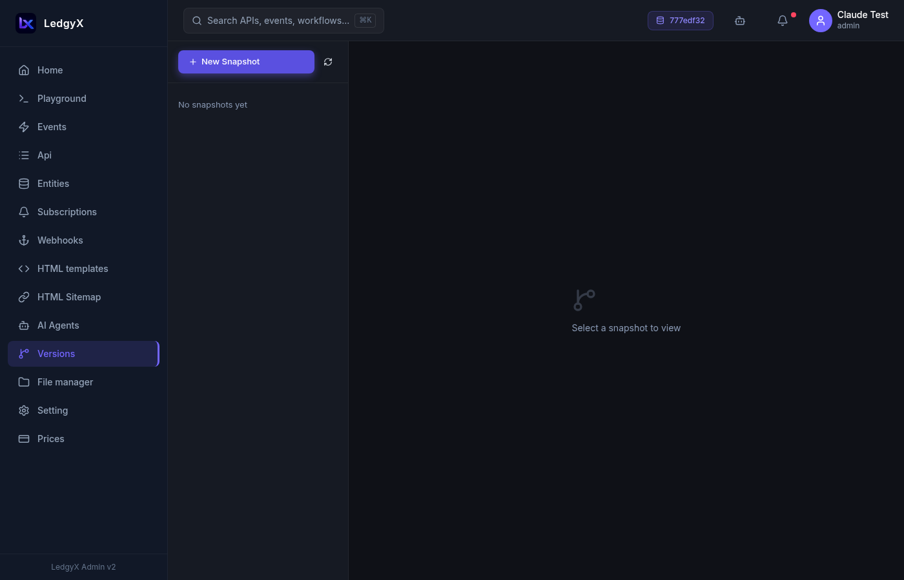
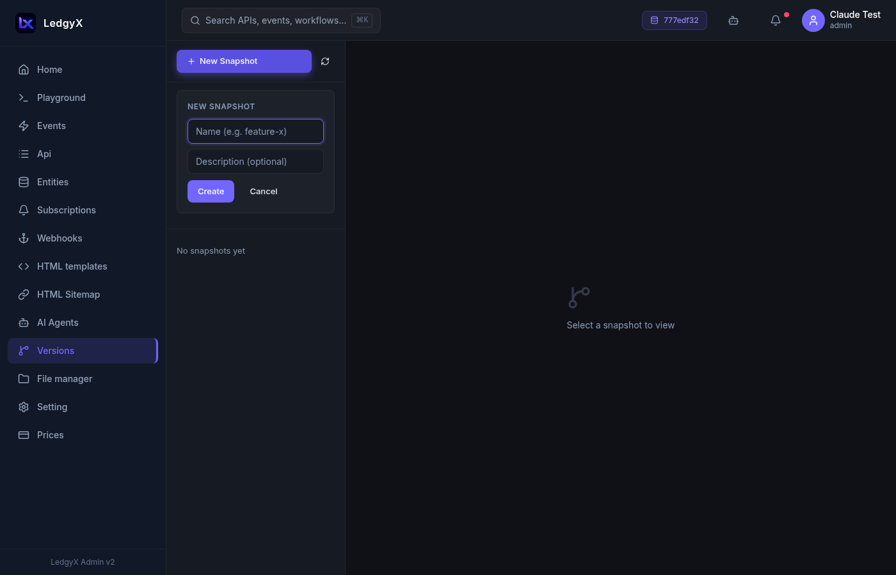

# Versions

The Versions page lets you **snapshot event changes before pushing them to production** — a safe way to test and review modifications without affecting live users.

  

## How versioning works

Every time you edit an event, you can choose to save it in two ways:

1. **→ Production** (default) — saves immediately as the live version
2. **→ Snapshot** — saves a staging copy that doesn't affect production yet

When you're ready, you **promote** the snapshot — all staged event changes go live at once.

This is useful for:
- Reviewing changes with a teammate before going live
- Grouping multiple related changes into a single release
- Rolling back by simply not promoting (the snapshot can be deleted)

## Creating a snapshot

On the Versions page:

1. Click **New Snapshot**
2. Enter a **name** (e.g. `v2.1-pricing-changes`) and optional **description**
3. Click **Create** — the snapshot appears in the list on the left

## Saving events to a snapshot

When editing an event in the [Events](events.md) page:

1. Look for the **snapshot selector** next to the Save button (appears when a config is active)
2. Choose a snapshot from the dropdown instead of "→ Production"
3. Click **Save to snapshot**

The Save button turns violet when a snapshot is selected — a visual reminder you're not saving to production.

## Reviewing a snapshot

Click a snapshot in the left panel to open its detail view:

- **Overrides count badge** — how many events have staged changes
- **Diff list** — one row per changed event, showing the event name and version numbers (e.g. `v3 → v4`)
- **Expand a row** — shows a side-by-side before/after view of the SQL with syntax highlighting

  

## Promoting a snapshot

When you're satisfied with the changes:

1. Click **Promote** (appears when `overrides_count > 0`)
2. Confirm the inline prompt: "Promote N event(s) to production?"
3. Click **Yes** — all staged events become the live version; the snapshot is archived

After promotion, the changes are immediately active in your REST API and event handlers.

## Deleting a snapshot

Click **Delete** on the snapshot detail panel and confirm inline. The staged versions are discarded — production is unchanged.

## Version numbers

Each saved version of an event gets a version number (v1, v2, v3…). The current production version number is visible in the **toolbar badge** (a GitFork icon with `v{N}`) whenever you select an event in Events, Subscriptions, or API Builder.

## Tips

- Snapshots are per-configuration — each workspace has its own version history.
- You can have multiple snapshots active at once — one per feature or team member.
- The snapshot selector has a minimum width so it doesn't crowd the toolbar on narrow screens.
- Deleting a snapshot does **not** revert any changes already promoted in a previous session.
