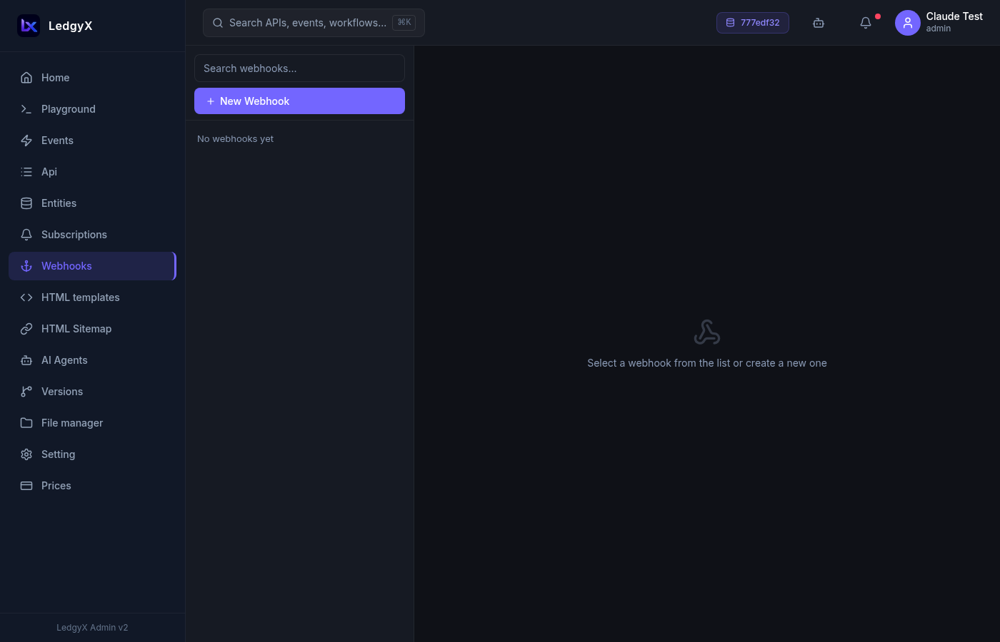

# Webhooks

Webhooks let you call **external HTTP services** from your platform — notify a third-party API, push data to a CRM, trigger a Zapier workflow, or post to any URL when something happens.

<p align="center">
  
</p>

## What is a webhook?

A webhook in Ledgyx is a saved outbound HTTP connection. You configure the URL, method, and headers once; then call it by name from any event SQL:

```sql
SELECT CALL(
  WEBHOOK "my_crm_hook"
  FROM &body
  NEXT "process_response"
  GET
) TYPE OBJECT;
```

## Creating a webhook

1. Click **New** in the list
2. Fill in:
   - **Name** — a unique identifier used when calling from SQL (e.g. `stripe_hook`, `slack_notify`)
   - **URL** — the target endpoint
   - **Method** — GET / POST / PUT / DELETE
   - **Headers** — key/value pairs (for `Authorization`, `Content-Type`, etc.)
   - **Description** — optional notes
3. Click **Save**

## Using webhooks in events

After saving a webhook, call it from any event SQL using the `CALL(WEBHOOK ...)` provider:

```sql
-- Notify Slack when a new order is created
SELECT CALL(
  WEBHOOK "slack_orders"
  FROM (SELECT &body.order_id AS text)
) TYPE OBJECT;
```

The `FROM` clause specifies the payload sent to the webhook. The `NEXT` clause (optional) names an event to call with the webhook's response.

## Tips

- Webhook **names** are permanent references — if you rename a webhook, update all events that call it.
- Use webhooks with [Subscriptions](subscriptions.md) to trigger external calls when data changes: subscription fires → exec event → `CALL(WEBHOOK ...)`.
- Store sensitive tokens (API keys, bearer tokens) in the **Headers** field — they're stored securely and not exposed to the frontend.
- The `NEXT "event_name" POST` clause lets you chain: the webhook response becomes the input of the next event.
